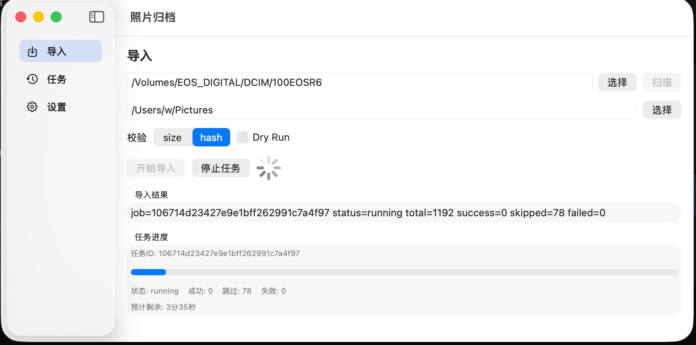
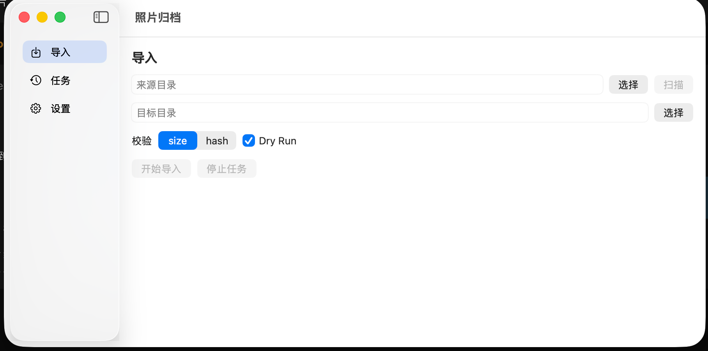
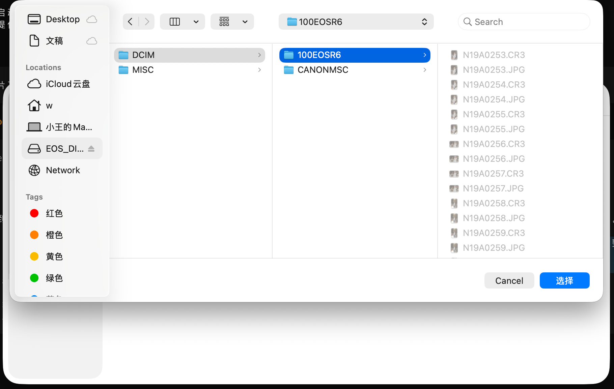
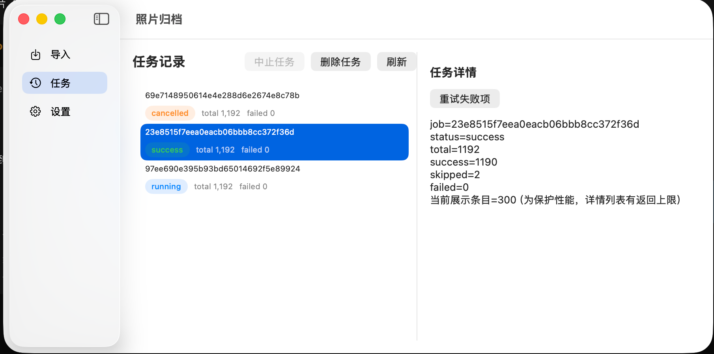
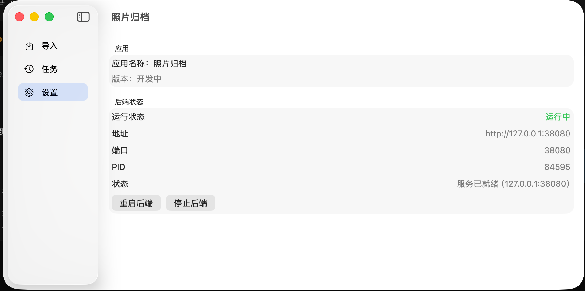

# Photo Archiver JOURNAL

## 项目说明

本项目用于解决大批量照片/视频从内存卡到备份目录的归档问题。

一个明确的实际背景是：过年外出旅游时拍摄了大量素材，回家后手工整理成本高、容易漏拷和重复拷贝，因此需要一个可追踪、可校验、可视化的整理工具。

## 开发方式说明

本项目从需求整理、技术设计、代码实现、UI 打磨到打包流程，**全程由 Codex 协作完成**（包括：
Go 核心链路、SQLite 任务模型、本地 API、SwiftUI 前端、任务管理交互、打包脚本与文档沉淀）。

## 运行界面记录

### 启动页

### 导入页

### 目录选择

### 任务页

### 设置页

